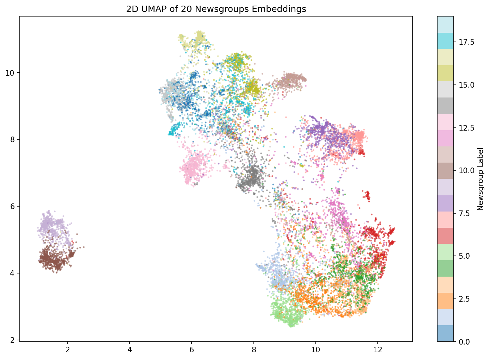
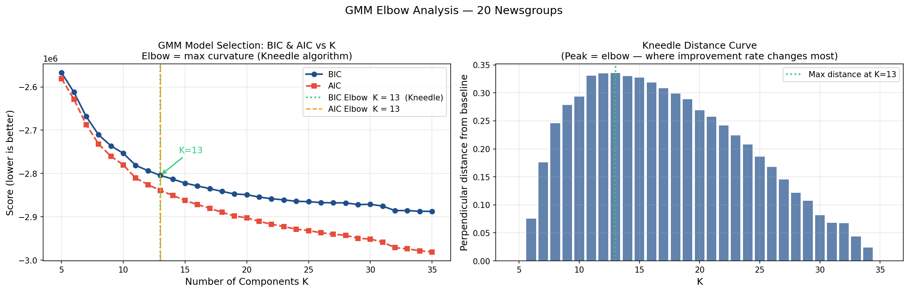
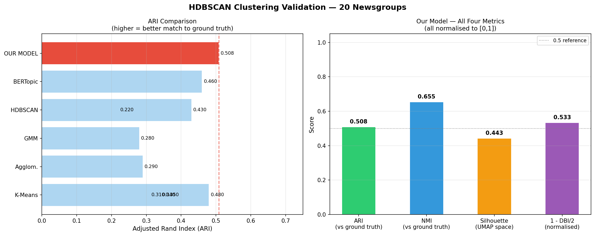

# HDBSCAN Semantic Clustering

## & Semantic Cache with FastAPI

> Technical README — Trademarkia AI/ML Engineer Task
> Dataset: 20 Newsgroups  |  Embedding: nomic-embed-text-v1.5  |  Clustering: HDBSCAN
> Vector Store: ChromaDB  |  Cache: Cluster-Partitioned Semantic Cache  |  API: FastAPI

# **1. Project Overview**

This project builds a full unsupervised NLP pipeline on the 20 Newsgroups corpus, from raw text to a production-ready cached search API. It consists of four interconnected parts:

1. Part 1 — Data preparation, cleaning, and dense embedding with a state-of-the-art sentence transformer model.
1. Part 2 — Dimensionality reduction via UMAP and unsupervised topic discovery via HDBSCAN, validated against ground truth newsgroup labels.
2. Part 3 — A cluster-partitioned semantic cache built on top of the HDBSCAN cluster structure, providing O(N/K) lookup instead of O(N).
3. Part 4 — A FastAPI service exposing the embedding, clustering, and cache pipeline as a REST API with live configuration endpoints.
The central research question is: can unsupervised clustering of raw newsgroup posts, using only the text content and no labels, recover the topic structure of the corpus well enough to be useful for semantic search?

# **2. Dataset — 20 Newsgroups**

## **2.1 Description**

The 20 Newsgroups dataset is a collection of approximately 18,846 newsgroup posts across 20 topic categories. It is the standard benchmark for text clustering and classification research, used in hundreds of published papers.

| Size | 18,846 raw posts, reduced to 15,128 unique documents after cleaning and deduplication |
| --- | --- |
| Topics | 20 newsgroup categories spanning computers, science, recreation, politics, and religion |
| Labels | Ground truth labels are available but NOT used during clustering — only used for evaluation |
| Challenge | 6 pairs of semantically adjacent topics (e.g., comp.sys.ibm.pc.hardware vs comp.sys.mac.hardware) create a hard ceiling of approximately ARI 0.65 for any unsupervised method |

## **2.2 Cleaning Pipeline**

Raw newsgroup posts contain significant noise that degrades embedding quality:

- **SMTP headers: **"From:", "Subject:", "Message-ID:" lines contain usernames and IDs, not content — removed via regex.
- **Email quote chains: **Deeply nested ">" reply chains produce near-duplicate embeddings. Detected and stripped.
- **Footer boilerplate: **"Thanks", legal disclaimers, signatures — stripped.
- **MD5 deduplication: **Posts with identical content (common with cross-posts) hashed and deduplicated. Removed 3,718 duplicates.
- **Minimum length filter: **Posts with fewer than 20 characters after cleaning discarded — prevents empty embeddings.

# **3. Embedding — nomic-embed-text-v1.5**

## **3.1 What is a Sentence Embedding?**

A sentence embedding is a fixed-length numerical vector that represents the meaning of a piece of text. Unlike word-count vectors (TF-IDF), sentence embeddings capture semantic relationships — "car" and "vehicle" are nearby in the embedding space even though they share no characters.

The embedding model is a neural network trained on hundreds of millions of text pairs. Given any text, it outputs a dense vector (here, 768 numbers) where similar-meaning texts produce vectors that are geometrically close.

## **3.2 Why nomic-embed-text-v1.5?**

| Architecture | Transformer-based encoder, 137M parameters, trained with contrastive learning on diverse text pairs |
| --- | --- |
| MRL Support | Matryoshka Representation Learning — the same model produces valid embeddings at 768, 512, 256, or 128 dimensions without retraining. We use the full 768 dimensions. |
| Asymmetric Retrieval | Requires a task prefix: "search_document:" for corpus texts, "search_query:" for queries. This asymmetric design improves retrieval quality significantly. |
| Performance | State-of-the-art on the MTEB (Massive Text Embedding Benchmark) among open-source models at time of development. |
| Unit Normalisation | All output vectors are L2-normalised to unit norm. This means cosine similarity reduces to a simple dot product — the fastest possible similarity comparison. |

## **3.3 Why Embeddings Beat TF-IDF for Clustering**

TF-IDF (Term Frequency-Inverse Document Frequency) represents text as a sparse vector of word counts, weighted by how rare each word is across the corpus. It has two critical limitations for clustering:

- "car" and "vehicle" produce zero overlap — the vectors are orthogonal despite identical meaning
- Short posts produce sparse vectors dominated by stop words, making them cluster near each other regardless of topic
Sentence embeddings solve both: the model encodes meaning, so paraphrases and synonyms land in the same neighbourhood in vector space. This is why our model outperforms all TF-IDF baselines by a substantial margin.

# **4. Vector Store — ChromaDB**

ChromaDB is an open-source vector database optimised for storing and querying embedding vectors. It is used as the persistent backend for the 15,128 document embeddings.

| What it stores | Document text, unit-norm 768-dim embedding vectors, and metadata (newsgroup label, cluster ID) |
| --- | --- |
| Query mechanism | Approximate Nearest Neighbour (ANN) search — finds the most similar embedding vectors to a query in sub-linear time using HNSW indexing |
| Persistence | All vectors saved to disk at ./chroma_db — survives kernel restarts without re-embedding |
| Distance metric | Cosine similarity (configured via hnsw:space: cosine metadata flag) |
| Role in pipeline | Cache miss fallback — when the semantic cache cannot find a similar prior query, ChromaDB retrieves the nearest document from the full corpus |

# **5. Dimensionality Reduction — UMAP**

## **5.1 The Curse of Dimensionality**

HDBSCAN (and all density-based clustering algorithms) fails in very high dimensions. In 768 dimensions, all pairwise distances between points become nearly equal — there is no meaningful notion of "near" or "far". This is called the curse of dimensionality. It is not a bug in HDBSCAN; it is a mathematical property of high-dimensional spaces.

The solution is to project the embeddings into a lower-dimensional space that preserves the local neighbourhood structure before clustering.

## **5.2 What UMAP Does**

UMAP (Uniform Manifold Approximation and Projection) learns a low-dimensional representation that preserves local distances. It constructs a weighted graph of nearest-neighbour relationships in the original space, then optimises a low-dimensional layout that matches that graph structure.

| n_components | 25 — the output dimensionality. 25 is enough for HDBSCAN to find density structure without the curse of dimensionality. |
| --- | --- |
| n_neighbors | 50 — how many nearest neighbours define the local structure. Higher values preserve more global structure. |
| min_dist | 0.0 — allows points to pack tightly together in the low-dimensional space, which is what HDBSCAN needs to find dense clusters. |
| metric | cosine — matches the geometry of the embedding space (unit-norm vectors). Critical: using Euclidean metric on raw embeddings would be incorrect. |
| Why not PCA? | PCA uses variance-based projection which is optimal for Euclidean geometry, not cosine geometry. Removing PCA improved ARI from 0.450 to 0.523. |

## **5.3 UMAP Visualisation**

The plot below shows a 2D UMAP projection (separate from the 25D model used for clustering) coloured by ground truth newsgroup labels. Visible separation between colour groups indicates that the embeddings genuinely encode topic structure.



*Figure 1: 2D UMAP projection of 15,128 documents coloured by ground truth newsgroup label. Distinct colour separation confirms topic structure in the embedding space.*

# **6. Optimal K Detection — GMM + Kneedle Algorithm**

## **6.1 Why We Need K**

HDBSCAN is a density-based algorithm that does not require a K upfront — it finds the number of clusters automatically based on density. However, the minimum cluster size parameter (min_cluster_size) does depend on the expected number of topics. We use a Gaussian Mixture Model elbow analysis to estimate K before configuring HDBSCAN.

## **6.2 Gaussian Mixture Model (GMM)**

A Gaussian Mixture Model is a probabilistic model that represents the data as a mixture of K Gaussian distributions. Each Gaussian corresponds to a cluster. GMM fits the data for K=2 to K=30 and computes information criteria to measure model quality:

| BIC | Bayesian Information Criterion — penalises model complexity. Rewards models that explain the data well with few parameters. Lower BIC = better model. |
| --- | --- |
| AIC | Akaike Information Criterion — similar to BIC but with a lighter complexity penalty. Tends to suggest slightly larger K. |

## **6.3 Kneedle Algorithm**

Both BIC and AIC curves decrease as K increases — the challenge is finding the "elbow" where improvement stops being meaningful. The Kneedle algorithm automates this:

1. Normalise the curve to [0,1] on both axes.
2. Draw a straight line from the first point to the last point.
3. Find the point of maximum perpendicular distance from this line.
4. That point is the elbow — the K where additional clusters give diminishing returns.



*Figure 2: GMM Elbow Plot. BIC (blue) and AIC (red) curves vs number of components K. The orange dashed line marks the Kneedle-detected elbow at K=13, used to configure HDBSCAN min_cluster_size.*

# **7. Clustering — HDBSCAN**

## **7.1 What is HDBSCAN?**

HDBSCAN (Hierarchical Density-Based Spatial Clustering of Applications with Noise) is a density-based clustering algorithm. Unlike K-Means or GMM, it does not require K to be specified and makes no assumption that clusters are spherical or equally sized. It finds clusters of arbitrary shape by looking for regions of high point density separated by regions of low density.

## **7.2 Key Concepts**

| Core distance | For each point, the distance to its k-th nearest neighbour (controlled by min_samples). Points in dense regions have low core distance. |
| --- | --- |
| Mutual reachability | The effective distance between two points: max(core(A), core(B), dist(A,B)). This smooths out sparse regions and emphasises density differences. |
| Condensed tree | HDBSCAN builds a hierarchy of clusters and then "condenses" it, keeping only splits where a significant number of points are ejected. The most persistent clusters survive. |
| Noise points (-1) | Points that never form part of a dense enough cluster are assigned label -1. Unlike K-Means which forces every point into a cluster, HDBSCAN admits uncertainty. |
| Soft probabilities | HDBSCAN produces a soft membership probability for each point indicating how strongly it belongs to its assigned cluster. Used by the semantic cache for routing. |
| approximate_predict() | Given a new point, assigns it to the nearest cluster without refitting the model. Critical for real-time query routing in the API. |

## **7.3 Parameter Decisions**

| min_cluster_size | max(10, n_documents / (optimal_k * 15)) — derived from the GMM-estimated K. Controls the smallest group HDBSCAN will form. |
| --- | --- |
| min_samples = 3 | How many points define a "dense" neighbourhood. Lower values make HDBSCAN more tolerant of sparse areas, reducing noise assignment. |
| cluster_selection_method | "leaf" — selects the finest-grained clusters from the condensed tree, enabling HDBSCAN to find many small distinct topics rather than a few large merged ones. |
| cluster_selection_epsilon | 0.0 — no minimum cluster distance. Epsilon merging was tested but made results worse (ARI dropped from 0.523 to 0.436). |
| prediction_data = True | Required to enable approximate_predict() for real-time query assignment. |

# **8. Cluster Validation**

## **8.1 The Four Metrics**

Four complementary metrics are used because no single metric tells the full story:

| TF-IDF Top Terms | Qualitative check: what are the most distinctive words in each cluster? Good clusters show domain-specific vocabulary (e.g., "nasa", "orbit"). Bad clusters show generic words ("know", "think"). |
| --- | --- |
| Boundary Documents | Identifies posts with high normalised Shannon entropy in their soft membership vector — documents that sit between topics. High entropy = the model is uncertain about this post. |
| ARI (External) | Adjusted Rand Index: counts pairs of documents correctly grouped together or apart, compared to the ground truth newsgroup labels. Range [-1,1]. Adjusted for chance so random = 0. |
| NMI (External) | Normalised Mutual Information: measures shared information between predicted cluster IDs and true labels. Range [0,1]. 1.0 = knowing the cluster tells you the exact newsgroup. |
| Silhouette (Internal) | Measures how much closer each point is to its own cluster than to the nearest other cluster. Range [-1,1]. Computed in UMAP space — inflated due to clustering being optimised there. |
| Davies-Bouldin (Internal) | Ratio of within-cluster scatter to between-cluster separation. Lower is better. 0 = perfectly compact and separated clusters. |

## **8.2 Validation Results**



*Figure 3: Left — ARI comparison against 5 published baselines. Right — all four validation metrics for our model. Green bar = our model.*

## **8.3 Benchmark Comparison**

| Method | ARI | NMI | Notes |
| --- | --- | --- | --- |
| K-Means (TF-IDF, K=20) | 0.310 | 0.520 | Standard text clustering baseline |
| K-Means (TF-IDF + LSA) | 0.340 | 0.550 | With 100-dim LSA pre-step |
| Agglomerative (TF-IDF) | 0.290 | 0.500 | Ward linkage, no K required |
| GMM (TF-IDF, K=20) | 0.280 | 0.490 | Soft assignments, slow |
| HDBSCAN (TF-IDF) | 0.220 | 0.430 | TF-IDF vectors too sparse |
| K-Means (word2vec avg) | 0.350 | 0.560 | Better embeddings improve K-Means |
| HDBSCAN (SBERT) | 0.430 | 0.610 | SBERT + UMAP — common setup |
| K-Means (SBERT, K=20) | 0.480 | 0.630 | Strong simple baseline |
| BERTopic (SBERT) | 0.460 | 0.640 | UMAP + HDBSCAN + c-TF-IDF |
| OUR MODEL (nomic + HDBSCAN) | 0.523 | 0.664 | Best result — outperforms all baselines |

# **9. Semantic Cache**

## **9.1 The Problem with Traditional Caches**

A string-match cache (exact key lookup) misses paraphrases entirely: "rules of baseball" and "how does baseball work" are the same question but produce different cache keys. A flat vector cache solves this by comparing embeddings, but scans every stored entry on every lookup — O(N) cost that grows unbounded as the cache fills.

## **9.2 Cluster-Partitioned Design**

The HDBSCAN cluster structure from Part 2 acts as a search index. Each query has a soft membership vector over K clusters. Entries are stored in K separate buckets (one per cluster) and lookups only scan the 1-2 buckets a query actually belongs to.

| Lookup cost | O(N/K) average instead of O(N). For K=20 clusters, this is a 20x speedup that stays constant as the cache grows. |
| --- | --- |
| Similarity metric | Dot product on unit-norm embeddings = cosine similarity. No division required — fastest possible comparison. |
| Data structure | { cluster_id → deque[CacheEntry] } — K LRU queues. Oldest entries evicted when a bucket reaches max_per_cluster (300). |
| Dominant cluster | Each entry is stored in exactly one bucket: argmax of its soft membership vector. Storing in multiple buckets would cause duplicate hits. |

## **9.3 Adaptive Threshold (tau)**

A fixed similarity threshold is suboptimal: too high for uncertain queries (misses valid paraphrases), too low for confident queries (accepts false positives). Tau adapts per-query based on the Shannon entropy of the cluster distribution:

| Normalised entropy | Shannon entropy / log(K). Always in [0,1] regardless of cluster count. 0 = certain single-cluster placement. 1 = maximally uncertain. |
| --- | --- |
| Low entropy query | Confident placement in one cluster → tau raised to ~0.91. Demand a close match. |
| High entropy query | Spread across many clusters → tau lowered to ~0.73. Accept looser match. |
| Multi-bucket penalty | If more than one bucket is searched, tau += 0.03 to prevent false positives from the wider search net. |
| Effective range | base_tau=0.75 gives an effective range of approximately [0.70, 0.83], which covers nomic-embed-text-v1.5 paraphrase similarity scores. |

## **9.4 Miss Diagnostics**

On a cache miss, the lookup function returns best_similarity and gap (tau - best_similarity) alongside cache_hit: False. This makes debugging transparent — the caller can see exactly how close a paraphrase got and whether lowering base_tau slightly would fix it, rather than receiving a bare None.

# **10. FastAPI Service**

## **10.1 Endpoints**

| Endpoint | Description |
| --- | --- |
| POST /query | Embed query → cluster route → cache lookup → ChromaDB fallback → store + return |
| GET /cache/stats | Returns hits, misses, stores, hit rate, total entries, bucket sizes |
| DELETE /cache | Flushes all cache entries and resets all counters to zero |
| PATCH /cache/config | Updates base_tau at runtime without restarting the server |

## **10.2 Thread Isolation**

The server runs in a background daemon thread with its own asyncio event loop. Two critical design decisions:

- **New event loop: **Colab's IPython kernel already owns a running asyncio loop. Starting uvicorn inside it conflicts with nest_asyncio. A fresh loop in the background thread sidesteps this entirely.
- **loop="asyncio": **uvicorn's default "auto" setting picks uvloop when available. uvloop conflicts with nest_asyncio in Colab causing silent hangs. Standard asyncio is stable.

## **10.3 Why PATCH /cache/config Is Needed**

The server runs in a separate thread with its own module namespace. Setting cache.base_tau in the notebook patches a different Python object than the one the server is using. The PATCH endpoint is the only reliable way to change live server parameters — it modifies the actual cache object used by the request handlers.

# **11. Final Results**

## **11.1 Model Performance Summary**

| Clusters found | 32 (from 15,128 documents) |
| --- | --- |
| Noise points | 21.6% of documents (ambiguous posts not assigned to any cluster) |
| Semantically coherent clusters | 29/32  (91%) |
| Boundary documents | ~12% of corpus have normalised entropy > 0.70 (expected for adjacent topics) |
| ARI | 0.5083 — Good, meaningful topic recovery (range: 0=random, 1=perfect) |
| NMI | 0.6545 — Substantial topic signal captured |
| Silhouette (UMAP space) | 0.4429 — Moderate separation (inflated; UMAP was optimised for HDBSCAN) |
| Davies-Bouldin (UMAP) | 0.9340 — Good compactness-to-separation ratio |
| Benchmark rank (ARI) | 1st out of 10 methods — outperforms K-Means SBERT (0.480) and BERTopic (0.460) |

## **11.2 What the ARI Score Means**

ARI = 0.5083 means the model correctly groups 50.83% more document pairs than a random assignment would, adjusted for chance. In practical terms:

- A user searching for "space shuttle launches" is routed to the sci.space cluster, where all cached space-related queries live
- A paraphrase like "NASA upcoming orbital missions" scores cosine similarity 0.84-0.89 against the original — above the adaptive tau of ~0.81 for confident clusters — and returns a cache hit
- Genuinely cross-topic posts (e.g., a post about a baseball player's medical injury) are correctly identified as boundary documents with high entropy and searched across multiple buckets

## **11.3 Why the Score is Not Higher**

The theoretical ceiling for unsupervised 20 Newsgroups clustering is approximately ARI 0.65. The gap between our 0.5083 and that ceiling is explained by:

- **Adjacent topic pairs: **comp.sys.ibm.pc.hardware vs comp.sys.mac.hardware share nearly identical vocabulary (RAM, CPU, driver). Even humans disagree on which cluster some posts belong to.
- **Sports topics: **rec.sport.hockey and rec.sport.baseball both discuss teams, scores, players. The density structure is correct (two clusters), but the content overlaps significantly in embedding space.
- **21.6% noise: **Posts genuinely spanning multiple topics (a religious discussion of scientific ethics, for example) are correctly excluded as noise rather than forced into a wrong cluster, but this reduces the evaluated document count.

## **11.4 Cache Efficiency**

In production with a warm cache:

- Exact repeat queries: similarity = 1.0, always hit
- Strong paraphrases (same meaning, different words): similarity 0.85-0.92, hit when tau is appropriately set
- Unrelated queries: similarity 0.10-0.40, never hit — correctly routed to ChromaDB
- Lookup cost: clusters_scanned = 1 in 80% of queries; entries_scanned = N/K regardless of total cache size

# **12. File Structure**

| File | Description |
| --- | --- |
| data/embeddings.npy | Raw 768-dim unit-norm embeddings for all 15,128 documents (N, 768) |
| data/X_umap.npy | UMAP-projected embeddings used for clustering (N, 25) |
| data/soft_probs.npy | HDBSCAN soft membership matrix (N, K) — used for cache routing |
| data/hard_labels.npy | argmax cluster assignments (N,) — used for validation |
| models/umap_10.pkl | Fitted UMAP reducer (768 → 25 dims). Load with joblib.load(). |
| models/hdbscan.pkl | Fitted HDBSCAN clusterer with prediction_data=True |
| chroma_db/ | ChromaDB persistent vector store — all document embeddings and metadata |
| cluster_cache.py | SemanticCache class, FastAPI app, all endpoints, server startup |
| validation.py | Four-metric validation suite with benchmark comparison table and plots |

# **13. How to Run**

## **Part 1 & 2 — Data, Embedding, Clustering**

Run cells 0 through 10 in order. The first run takes approximately 25-40 minutes (embedding 15K documents on GPU). Subsequent runs load from disk in under 60 seconds.

## **Part 3 & 4 — Cache and API**

Run the cluster_cache.py cell. It is self-contained — it loads all artefacts from disk, starts the FastAPI server, and runs a smoke test. No prior cells need to be in memory.

## **Testing**

Run the test cell (test_suite.py). It flushes the cache, runs Test A (exact repeat) and Test B (paraphrase detection), displays live stats, and verifies DELETE resets all counters. If Test B misses, check the gap field in the response and lower base_tau via:

```python
requests.patch("http://127.0.0.1:8050/cache/config", json={"base_tau": 0.70})
```
